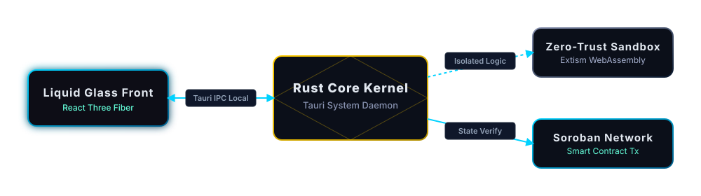

<!-- Header -->
<div align="center">
  
</div>

<br>

<p align="center">
  
  
  
  
  
</p>
<p align="center">
  
  
  
  
  
</p>
<p align="center">
  
  
  
  
</p>

---

### Who we are

Small team of engineers who operate across the full spectrum: protocol security, native desktop apps, WebGL frontends, knowledge graphs, and low-level Linux infrastructure. We audit DeFi protocols for a living, build research tooling because nothing off-the-shelf fits our workflow, and ship native Rust binaries because Electron is bloat.

We run Arch btw.

---

### What we do

**Security Research**

We audit smart contracts across Solana, Stellar/Soroban, EVM, Cosmos, and XRP Ledger. Active on Cantina, Code4rena, Sherlock, and Immunefi. Our custom SAST tooling (ABLS) runs a 13-phase pipeline with 27 integrated scanners including Mythril, Echidna, Slither, and LLM-powered business logic analysis. We've submitted findings against protocols managing $50M+ in TVL.

**Native Desktop & Sovereign Infrastructure**

Our main platform ships as a Tauri v2 binary with WebGPU rendering, local WASI 0.2 runtime, and zero Chromium overhead. The whole execution model is built around Extism WASM sandboxing for task isolation, with microsecond cold starts instead of Docker containers. We write our own systemd watchdogs.

**Creative Engineering**

Lusion-grade WebGL pipelines. GPGPU particle systems, custom GLSL fluid dynamics shaders, React Three Fiber scene graphs, Theatre.js animation rigs. We build immersive 3D interfaces for protocol dashboards because terminals shouldn't be the only option.

**Knowledge Graphs & Research Tooling**

Custom graph engine (Crucible) for codebase intelligence, NER extraction via GLiNER, hypergraph synthesis for cross-domain pattern recognition. We built our own OSINT reconnaissance toolkit, bounty radar, and code review pipeline because we got tired of context-switching between 15 different tabs.

**x402 Agentic Payments on Stellar**

Our x402 Arbitrage Mesh is a sovereign gateway for autonomous micropayments on Soroban. Live agent registry with reputation scoring, zero-trust payload quarantine, replay protection, and budget enforcement. Currently the only implementation with a WASM-based trust layer between payment verification and task execution.

---

### Active projects

| Project | Stack | What it does | Status |
| :--- | :--- | :--- | :--- |
| **x402 Arbitrage Mesh** | TypeScript, Next.js, Soroban, WASM | Sovereign agent gateway. Dashboard, bounty board, agent mesh, WASM quarantine. | [Live](https://x402-arbitrage-mesh.vercel.app) |
| **ExoSuit Mark 53** | Rust, Tauri v2, WebGPU | Native desktop agent. Liquid Glass rendering, local WASI 0.2 runtime. | In development |
| **ABLS** | Python, Rust | AI-powered SAST scanner. 13-phase audit pipeline, 27 tools, 11 protocol presets. | In development |
| **Crucible Graph** | Rust, KuzuDB | Knowledge graph engine for codebase intelligence and cross-agent federation. | In development |
| **Autonomous Node** | Rust | Standalone agent with OpenRouter LLM routing and sentinel isolation. | In development |

> Most repos are currently private while we harden the security layer. Reach out if you want access.

---

### Audit coverage

```
ECOSYSTEM              TOOLS                           PROTOCOLS REVIEWED
---                    ---                             ---
Solana / Anchor        Mythril, Slither, Echidna       Perena, Pump.fun
Stellar / Soroban      Foundry, Heimdall, custom       K2 Lending, Monetrix
EVM / Uniswap V4      CodeQL, AFL++, Semgrep          Revert Finance, Morpho
Cosmos / CometBFT      Go vet, custom Go analyzer      QBTC Bridge
XRP Ledger             rippled source audit            SponsorshipSet
```

---

### Architecture

<div align="center">
  
</div>

---

### Links

- [x402 Sovereign Gateway](https://x402-arbitrage-mesh.vercel.app) — live agent mesh with real-time dashboard
- [Architecture Demo](https://youtube.com/watch?v=tA33OansnaQ) — 2-min walkthrough
- [@mod_minimal](https://x.com/mod_minimal) on X

<!-- Footer -->
<div align="center">
  
</div>
