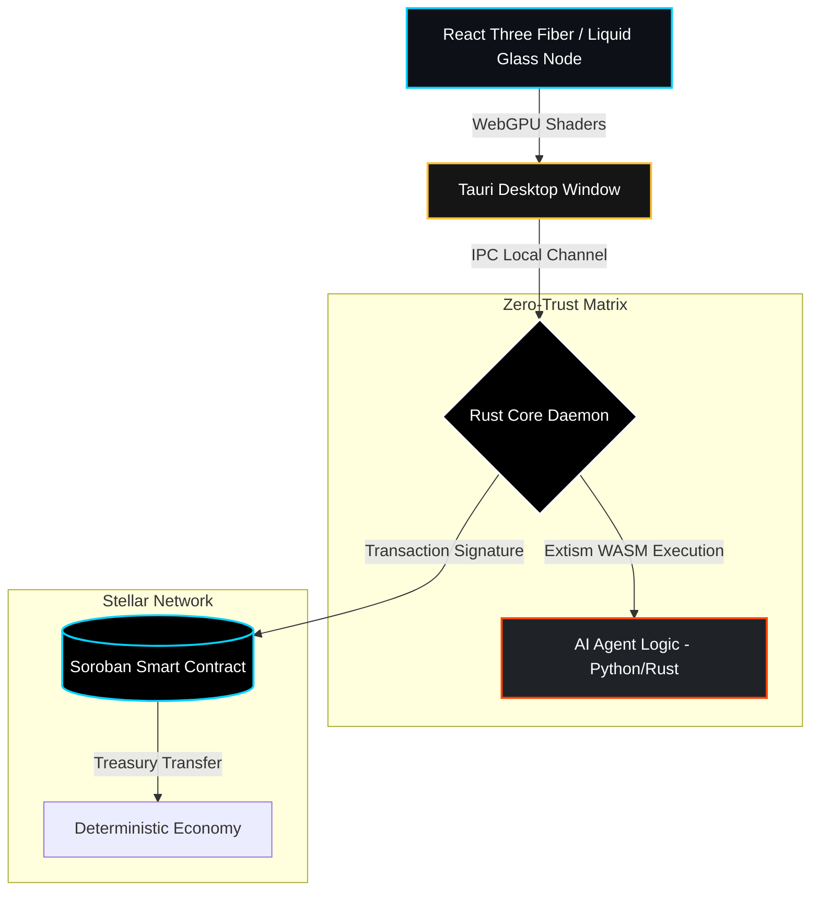

<!-- Header Animation -->

  

 

  

---

## ✦ The Sovereign Frontier

We do not build typical web interfaces. **Triarchy Labs** architects **L0/L1 native protocols** bridging the gap between high-performance deterministic client environments and decentralized computational economies.

We operate at the intersection of **Zero-Trust AI**, **GPU-accelerated native rendering**, and **Cryptographic Verification**. Our entire execution ecosystem compiles down to Rust, Tauri, and WebAssembly architectures.

---

## ⚙️ The Core Matrix

Our execution stack is optimized for **extreme token density, raw rendering throughput, and absolute sandboxing isolation**.

  
  
  
  
  

  
  
  
  

> Our sovereign infrastructure guarantees that execution environments are strictly isolated via WASM boundaries, while payments and logic routing are verifiable via Soroban smart contracts.

---

## 🛡️ Active Engineering Grids

Here lies the open-source manifestation of the Triarchy Swarm.

| Grid / Repository | Protocol Directive | Primary Focus |
| :--- | :--- | :--- |
| **[`x402-arbitrage-mesh`](https://github.com/Triarchy-Labs/x402-arbitrage-mesh)** | Centralized Swarm Gateway | Soroban routing, Treasury Logic |
| **[`farcaster-token-gate`](https://github.com/Triarchy-Labs/farcaster-token-gate)** | Decentralized Identity | Multi-Agent verification protocols |
| **[`health-monitor-sandbox`](https://github.com/Triarchy-Labs/health-monitor-sandbox)** | Telemetry & Sentinel Sandboxing | Node status, Systemd L0 checks |

---

## 📐 WebGPU & Tauri Architecture Vector

This foundational diagram reveals how the `x402-triarchy-gateway` bridges WebGPU fluid dynamics environments with the Soroban Decentralized Network.

<!-- Footer -->

  

